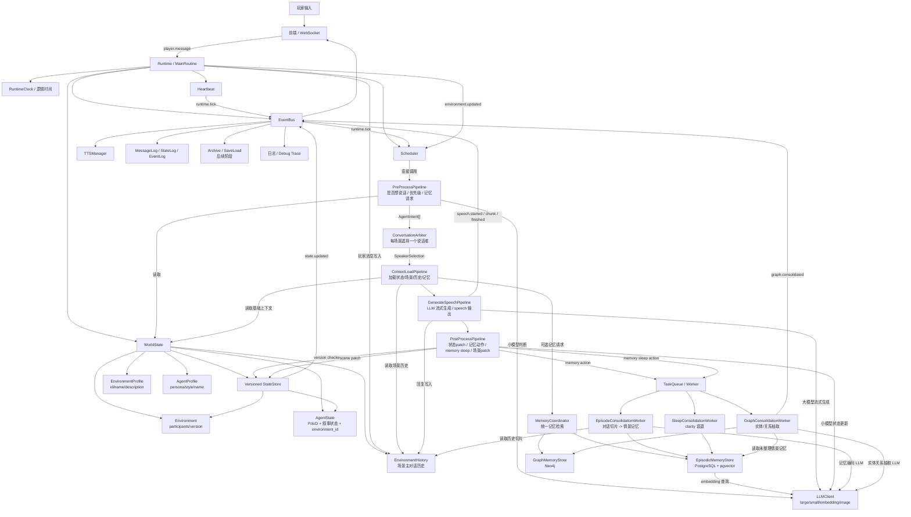
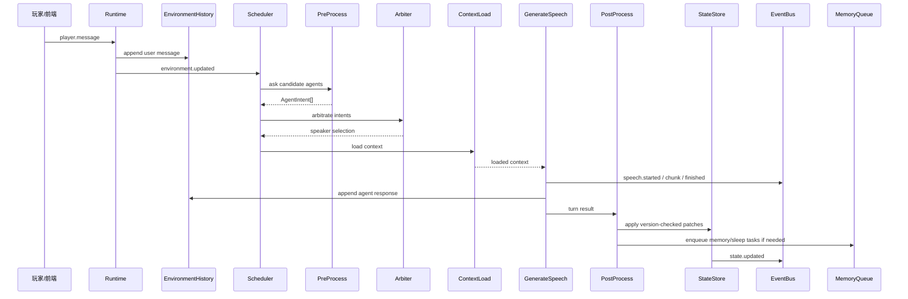
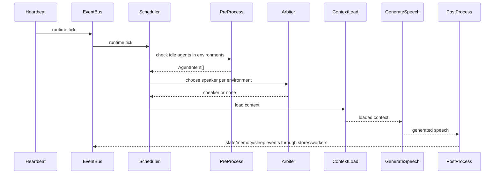

# Ember v2 目标架构说明

本文描述 Ember v2 的目标架构：系统长什么样、每个模块承担什么功能、模块之间如何通信。

v2 的核心目标是把当前单角色 AI 伴侣重构为一个多 Agent、多 Environment 的生命模拟运行时。第一版先不重做前端、存档和工具调用，优先跑通核心生命循环。

## 1. 总体结构

```text
ember_v2/
  runtime.py              # MainRoutine / Runtime，总生命周期入口
  clock.py                # 逻辑时间与时间加速
  events.py               # 事件类型定义，可复用旧 EventBus
  world.py                # WorldState，管理 agents/environments
  scheduler.py            # tick/update 调度器
  environment.py          # EnvironmentProfile / EnvironmentRuntime / EnvironmentHistory
  agent.py                # AgentProfile / AgentState / AgentRuntime
  state_store.py          # 版本化状态读写
  arbitration.py          # 同一场景内谁能说话的仲裁器
  pipeline/
    preprocess.py         # 前处理，生成 AgentIntent
    context.py            # 上下文加载
    generation.py         # 对话生成与流式输出
    postprocess.py        # 状态、记忆、睡眠、场景迁移后处理
  memory/
    coordinator.py        # 记忆协调器
    environment_history.py# 场景对话历史
    episodic_store.py     # 情景记忆存储
    graph_store.py        # 图谱记忆存储
    consolidation.py      # 记忆整理/睡眠整理 worker
  adapters/
    v1_llm_client.py      # 复用旧 LLMClient
    v1_event_bus.py       # 复用/包装旧 EventBus
    v1_episodic.py        # 复用/迁移旧 EpisodicMemory
    v1_graph.py           # 复用/迁移旧 Neo4jGraphMemory
```

第一版可以不完全按这个目录一次性落地，但模块职责应该按这个边界设计。

## 2. 核心对象

### Runtime / MainRoutine

职责：

- 创建并持有 `EventBus`。
- 创建并持有 `RuntimeClock` / heartbeat。
- 创建并持有 `WorldState`。
- 创建 `Scheduler` 和各条 pipeline。
- 启动、暂停、恢复、关闭系统。
- 接收外部玩家输入，并转成世界事件。

不负责：

- 不直接决定哪个 Agent 说话。
- 不直接拼 prompt。
- 不直接写记忆。
- 不直接修改 AgentState 细节。

Runtime 是系统入口，不是业务大脑。

### RuntimeClock

职责：

- 提供逻辑时间 `logical_now`。
- 支持时间加速。
- 格式化逻辑时间。
- 给状态更新、记忆、对话记录提供统一时间源。

可复用旧项目：

- `core/event_bus.py` 里的逻辑时间设计。

### EventBus

职责：

- 跨模块发布事件。
- 让前端、日志、TTS、存档、后台 worker 等旁路系统监听运行时变化。

原则：

- EventBus 用于跨模块通知和副作用。
- 核心 pipeline 内部优先使用明确的函数调用和结构化返回值。
- 不要让所有业务决策都变成事件接力，否则会变成新的事件屎山。

可复用旧项目：

- `core/event_bus.py` 可作为第一版 EventBus。

### WorldState

职责：

- 保存所有 runtime `Environment`。
- 保存所有 `AgentState`。
- 提供按 id 查询 Agent / Environment 的接口。
- 维护 Agent 所属 Environment 的一致性。

典型操作：

```text
get_agent(agent_id)
get_environment(environment_id)
move_agent(agent_id, target_environment_id)
list_agents_in_environment(environment_id)
apply_agent_patch(agent_id, patch, base_version)
```

不负责：

- 不调用 LLM。
- 不做仲裁。
- 不生成记忆。

### EnvironmentProfile / Environment

第一版不维护独立的可变 `scene_state`。场景拆成稳定说明和运行时容器。

`EnvironmentProfile` 字段：

```json
{
  "environment_id": "env_nju_library_study_room",
  "name": "南京大学鼓楼校区北园图书馆自习室",
  "description": "午后的图书馆自习室，靠窗座位阳光充足，适合安静学习和低声交谈。"
}
```

runtime `Environment` 持有：

- `profile`
- `participants`
- `EnvironmentHistory`
- `version` / history cursor metadata

职责：

- 表达场景级稳定说明。
- 记录当前有哪些 Agent 在场。
- 作为 Agent 生成回复和状态更新的公共上下文。

不负责：

- 不保存角色内心。
- 不保存角色目标。
- 不保存完整世界观。
- 第一版不保存单独的 `scene_state`；动态情境主要在各 Agent 的
  `客观情境` 与场景历史中体现。

### EnvironmentHistory

职责：

- 每个 Environment 拥有一份主对话历史。
- 记录玩家和 Agent 在该场景内发生的消息。
- 提供最近 N 条历史给 prompt 和状态更新。
- 作为情景记忆整理的来源。

第一版决策：

- 只做 Environment 主历史。
- 暂不做 Agent 私有 noticed log / working memory。

可复用旧项目：

- `memory/short_term.py` 的 append、truncate、保存、读取逻辑。
- 但 owner 从全局单例改成每个 Environment。

### AgentProfile

职责：

- 保存 Agent 的稳定设定。
- 包含 persona、说话风格、背景、角色名等。

典型字段：

```json
{
  "agent_id": "yiming",
  "display_name": "依鸣",
  "persona_prompt": "...",
  "speaking_style": "...",
  "is_player": false
}
```

### AgentState

第一版字段：

```json
{
  "agent_id": "yiming",
  "environment_id": "env_nju_library_study_room",
  "P": 8,
  "A": 6,
  "D": 5,
  "客观情境": "南京大学鼓楼校区北园，午后的图书馆自习室。依鸣坐在靠窗的位置，阳光依旧温暖。",
  "近期综合轨迹": "在图书馆自习了一上午 -> 中午吃了热汤面 -> 下午继续整理算法课笔记",
  "内心活动": "她有点好奇，也有点不好意思。",
  "近期目标": "自然地了解对方的年级和专业。",
  "对应时间": "2026-03-06 14:22:13",
  "version": 1
}
```

已确认决策：

- 保留叙事型中文状态。
- 保留顶层 `P/A/D`。
- 保留 `对应时间`。
- 增加 `agent_id`、`environment_id`、`version`。
- 不增加 `sleepiness`。
- 不增加独立 `current_action`。
- 一个 Agent 同一时间只属于一个 Environment。
- `客观情境` 可以描述该 Agent 视角下的部分场景动态，因此第一版不再为
  Environment 单独维护 `scene_state`。

职责：

- 表达角色当前视角下的状态。
- 作为 prompt 注入的核心材料。
- 作为后处理 state patch 的目标。

### AgentRuntime

职责：

- 连接 AgentProfile、AgentState、memory handle 和 pipeline。
- 判断该 Agent 是否可被调度。
- 执行该 Agent 的 pre-process / generation / post-process。

不负责：

- 不拥有全局调度权。
- 不直接选择其他 Agent 是否发言。

## 3. 调度与对话流程

### Scheduler

职责：

- 监听 tick 或 environment update。
- 找出需要处理的 Environment。
- 找出 Environment 中需要进入前处理的非玩家 Agent。
- 生成候选任务。

输入：

```text
runtime.tick
environment.updated
player.message
```

输出：

```text
AgentUpdateTask[]
```

不负责：

- 不调用 LLM 生成正文。
- 不写状态。
- 不做记忆整理。

### ConversationArbiter

职责：

- 在同一 Environment 中，从多个 `AgentIntent` 里选择一个说话者。

第一版策略：

- 每个 Environment 每轮最多选一个 Agent 说话。
- 玩家输入优先触发同场景 Agent 响应。
- idle 发言需要通过优先级和冷却判断。

输入：

```json
[
  {
    "agent_id": "yiming",
    "wants_to_speak": true,
    "priority": 0.78,
    "reason": "玩家刚刚直接向她说话"
  }
]
```

输出：

```json
{
  "speaker_agent_id": "yiming",
  "environment_id": "env_nju_library_study_room"
}
```

## 4. Pipeline

### PreProcessPipeline

职责：

- 类似旧项目 `PRE_ROUTING_PROMPT`，但对象从“用户输入”扩展为“Agent 是否要行动”。
- 判断 Agent 是否想说话。
- 判断是否需要检索记忆。
- 判断记忆检索参数。
- 给仲裁器提供优先级。

输入：

```json
{
  "agent_state": {},
  "environment_state": {},
  "recent_environment_history": [],
  "trigger": {
    "type": "player_message | tick | environment_update",
    "content": "..."
  }
}
```

输出：

```json
{
  "agent_id": "yiming",
  "environment_id": "env_nju_library_study_room",
  "wants_to_speak": true,
  "priority": 0.78,
  "speech_intent": "回应玩家的搭话，并自然延续话题",
  "memory_requests": [
    {
      "query": "对方此前是否提到过图书馆或专业",
      "keywords": ["图书馆", "专业"],
      "required": false
    }
  ],
  "reason": "玩家直接和依鸣说话，对话与她当前状态相关"
}
```

可复用旧项目：

- `brain/core.py` 里的 pre-routing 思路。
- `config/prompts.yaml` 里的 `pre_routing_prompt` 可改造。

### ContextLoadPipeline

职责：

- 按 pre-process 的结果加载上下文。
- 强制加载基础上下文。
- 可选加载记忆、图谱、搜索结果等。

第一版强制上下文：

- AgentProfile
- AgentState
- EnvironmentProfile
- 当前 Environment participants
- EnvironmentHistory 最近 N 条
- 当前逻辑时间

第一版可选上下文：

- Episodic memory
- Graph memory

输出：

```json
{
  "profile_context": "...",
  "agent_state_context": "...",
  "environment_context": "...",
  "history_context": "...",
  "memory_context": "..."
}
```

### GenerateSpeechPipeline

职责：

- 构建最终 prompt。
- 调用大模型流式生成。
- 解析 `<thought>` / `<speech>`。
- 发布流式事件。
- 返回结构化 SpeechOutput。

输入：

```json
{
  "speaker_agent_id": "yiming",
  "environment_id": "env_nju_library_study_room",
  "loaded_context": {},
  "speech_intent": "..."
}
```

输出：

```json
{
  "agent_id": "yiming",
  "environment_id": "env_nju_library_study_room",
  "text": "原来你真的经常在这边啊……那我可能真的太专注了。",
  "thought": "...",
  "tts": {
    "emotion": "curious"
  }
}
```

发布事件：

```text
speech.started
speech.chunk
speech.finished
```

可复用旧项目：

- `brain/core.py` 的 streaming 逻辑。
- `brain/tag_utils.py`。
- `brain/tts.py` 可后续接入。

### PostProcessPipeline

职责：

- 根据本轮对话、环境、角色状态生成更新。
- 更新 AgentState。
- 决定是否触发记忆整理。
- 决定是否触发 memory sleep 整理。
- 决定是否触发场景迁移。

输入：

```json
{
  "agent_state_before": {},
  "environment_profile": {},
  "turn": {
    "user_or_trigger": "...",
    "speaker_output": "..."
  },
  "history_slice": []
}
```

输出：

```json
{
  "base_agent_version": 1,
  "agent_state_patch": {
    "P": 8,
    "A": 6,
    "D": 5,
    "客观情境": "...",
    "近期综合轨迹": "...",
    "内心活动": "...",
    "近期目标": "...",
    "对应时间": "2026-03-06 14:22:13"
  },
  "memory_actions": [
    {
      "type": "episode_consolidation",
      "required": false
    }
  ],
  "sleep_action": false,
  "scene_patch": null
}
```

可复用旧项目：

- `persona/state_manager.py` 的 state update prompt。
- `persona/state_manager.py` 的 idle evolution prompt。
- 旧 `action_pulse` 思路，但应改成结构化 `memory_actions` /
  `sleep_action` / `scene_patch`。

当前决策：

- `sleep_action` 只是触发记忆 sleep / consolidation 的布尔信号，不代表角色
  剧情上进入睡眠。
- 场景移动、环境创建或 participants 调整走 `scene_patch`，与
  `sleep_action` 分离。

## 5. 记忆系统

### MemoryCoordinator

职责：

- 统一处理记忆查询。
- 根据 agent_id 和 environment_id 限定作用域。
- 合并情景记忆和图谱记忆。

输入：

```json
{
  "agent_id": "yiming",
  "environment_id": "env_nju_library_study_room",
  "query": "...",
  "keywords": []
}
```

输出：

```json
{
  "episodic_memories": [],
  "graph_entities": {},
  "graph_relations": []
}
```

可复用旧项目：

- `memory/memory_process.py` 的 `Hippocampus.query_memory` 思路。

### EpisodicMemoryStore

职责：

- 存储情景记忆。
- 支持 embedding 检索。
- 支持 keyword 检索。
- 支持 clarity / importance / access_count。

v2 需要新增作用域字段：

```text
agent_id
environment_id
```

可复用旧项目：

- `memory/episodic_memory.py` 的 PostgreSQL + pgvector 查询逻辑。

### GraphMemoryStore

职责：

- 存储实体和关系。
- 支持实体别名。
- 支持实体关系检索。

可复用旧项目：

- `memory/neo4j_memory.py`。

### MemoryConsolidationWorker

职责：

- 从 EnvironmentHistory 中截取历史。
- 生成情景记忆。
- 写入 EpisodicMemoryStore。
- 在 sleep 时触发图谱整理。

可复用旧项目：

- `memory/memory_process.py` 的 `memory.preprocess` 流程。
- `memory/entity_extraction.py` 的图谱整理流程。
- `memory/episodic_memory.py` 的 sleep clarity 衰退逻辑。

## 6. 状态写入与脏数据处理

所有异步 LLM 更新都必须带 base version：

```json
{
  "agent_id": "yiming",
  "base_agent_version": 12,
  "agent_state_patch": {}
}
```

StateStore 应用 patch 时：

```text
if base_version != current_version:
    discard or requeue
else:
    apply patch
    version += 1
```

需要版本控制的对象：

- AgentState
- Runtime Environment metadata where needed
- EnvironmentHistory cursor / turn id

这样可以避免：

- idle 更新覆盖玩家刚触发的新状态
- 旧场景的后处理把 Agent 拉回错误环境
- 睡眠整理结果污染已经变化的状态

## 7. 模块通信方式

v2 使用三种通信方式。

### 直接调用

用于核心 pipeline 内部：

```text
Scheduler -> PreProcessPipeline
Arbiter -> ContextLoadPipeline
ContextLoadPipeline -> GenerateSpeechPipeline
GenerateSpeechPipeline -> PostProcessPipeline
PostProcessPipeline -> StateStore / MemoryQueue
```

优点：

- 输入输出清楚。
- 易测试。
- 不容易形成事件迷宫。

### EventBus

用于跨模块通知和副作用：

```text
runtime.tick
player.message
environment.updated
speech.started
speech.chunk
speech.finished
state.updated
memory.consolidation.requested
memory.sleep.requested
graph.consolidated
```

适合监听者：

- WebSocket / frontend broadcast
- TTS
- 日志
- 存档
- 后台 worker

### TaskQueue / Worker

用于耗时后台任务：

```text
memory consolidation
graph consolidation
embedding generation
image generation
long state summarization
```

原则：

- 用户对话主流程不能被长任务阻塞。
- 长任务返回时必须检查版本。

## 8. 第一版最小可运行切片

第一版只做：

- 一个 Runtime。
- 一个默认 Environment。
- 一个玩家 Agent。
- 一个非玩家 Agent。
- EnvironmentHistory。
- 玩家输入触发非玩家 Agent 回复。
- tick 触发非玩家 Agent idle pre-process。
- AgentState 叙事型更新。
- 简单 MemoryCoordinator adapter。

暂不做：

- 前端重构。
- 存档重构。
- 工具调用重构。
- 多 Agent 私有 noticed log。
- 一个 Agent 多 Environment 并发。
- 完整数据库迁移。

## 9. v1 复用边界

可以直接复用或轻包装：

- `core/event_bus.py`
- `core/heartbeat.py`
- `brain/llm_client.py`
- `brain/tag_utils.py`
- `memory/db_pool.py`
- `memory/neo4j_memory.py`

通过 adapter 复用：

- `memory/short_term.py` -> `EnvironmentHistory`
- `memory/episodic_memory.py` -> `EpisodicMemoryStore`
- `memory/memory_process.py` -> `MemoryCoordinator`
- `memory/entity_extraction.py` -> `MemoryConsolidationWorker`
- `memory/db_memory.py` -> `MessageLog` / `StateLog`
- `persona/state_manager.py` -> state prompt 和 idle prompt 资产
- `brain/core.py` -> streaming、queue、pre-routing 经验

不要直接复用为架构中心：

- `Brain`
- `StateManager`
- 全局 `settings.STATE`
- 全局 `chat_memory.json`
- 全局 `chat_history.log`

## 10. 通信拓扑图

这张图描述 v2 第一版的完整通信方式：核心链路用直接调用，外围通知用 EventBus，耗时任务用 TaskQueue / Worker。



## 11. 主流程时序图

玩家输入触发回复：



tick 触发 idle 行为：


